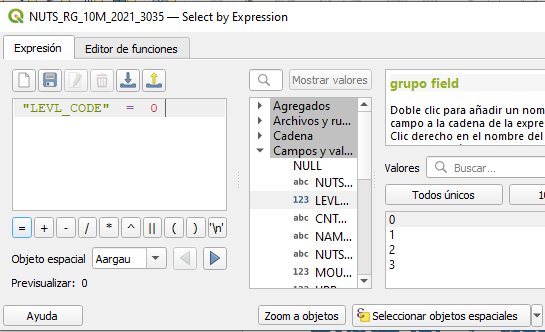
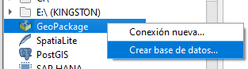

# Seminario de cartografía 

> Fecha **23 febrero de 2023**
> Autor **José Manuel Mira Martínez**


# INDICE

**Servicios de mapa**

IDEE/IDEV → Descarga vectorial /ráster

*   WMS vs Vector tiles y TMS
*   Carga en QGIS

**Cartografía coroplética**:

Fuente de datos oficiales:

a) Cartográficos: IDEE/NUTS

b) Estadísticos: INE, Geostat


**Organización de un proyecto SIG**

*   Creación de una base de datos espacial unificada
*   Importación de datos procedente de diferentes fuentes
    *   Preparar las hojas de cálculo para la unión de tablas
    *   Prepara los shp /gpkg oficiales para unir tablas (INE/NUTS)
    *   Preparar la información tabular para unirla al vectorial
        *   De XLS/ODT al proyecto de Qgis
        *   Del TOC de Qgis al GPKG
        *   Otros: De tablas ASCII al GPKG
*   Uniones físicas o temporales

**Explotación de los datos:**

*   Generar información a partir de las tablas: calculadora de campos
*   Geoprocesos: Ejemplo centroides
*   Selección por expresiones: básicas y avanzadas
*   El lenguaje de consulta estructurado: SQL

**Simbolización avanzada**:

*   Intervalos de clase: cuantiles, intervalos iguales, ruptura natural
*   Guardar leyendas en ficheros
*   Toponimia graduada
*   Simbolización con SVG
*   Símbolos graduados


**Del GIS (SIG) a al WebGIS**

*   El estándar GeoJSON
*   API para mapas (Leaflet)


NOTA: Todos lo datos que necesitas para este seminario lo encontrarás en la carpeta "seminario"


**SERVICIOS DE MAPAS**

IDEE/IDEV → Descarga vectorial /ráster

*   WMS vs Vector tiles y TMS
*   Carga en QGIS

# Repositorios XYZ Tiles

Procedente de: [http://www.idesa.gob.ar/2021/03/25/mas-mapas-xyz-tiles/](http://www.idesa.gob.ar/2021/03/25/mas-mapas-xyz-tiles/)

**Google Maps**: [https://mt1.google.com/vt/lyrs=r&x={x}&y={y}&z={z}](https://mt1.google.com/vt/lyrs=r&x=%7Bx%7D&y=%7By%7D&z=%7Bz%7D)

**Google Satellite:** [http://mt0.google.com/vt/lyrs=s&hl=en&x={x}&y={y}&z={z}&s=Ga](http://mt0.google.com/vt/lyrs=s&hl=en&x=%7Bx%7D&y=%7By%7D&z=%7Bz%7D&s=Ga)

**Google Hybrid:** [https://mt1.google.com/vt/lyrs=y&x={x}&y={y}&z={z}](https://mt1.google.com/vt/lyrs=y&x=%7Bx%7D&y=%7By%7D&z=%7Bz%7D)

**Google Traffic:** [https://mt1.google.com/vt?lyrs=h@159000000,traffic|seconds\_into\_week:-1&style=3&x={x}&y={y}&z={z}](https://mt1.google.com/vt?lyrs=h@159000000,traffic%7Cseconds_into_week:-1&style=3&x=%7Bx%7D&y=%7By%7D&z=%7Bz%7D)

**Google Roads:** [https://mt1.google.com/vt/lyrs=h&x={x}&y={y}&z={z}](https://mt1.google.com/vt/lyrs=h&x=%7Bx%7D&y=%7By%7D&z=%7Bz%7D)


Ver más casos (Bing, ESRI) visitando la página web indicada arriba

**Práctica**: Visita la web de bajo para ver otras fuentes y su aplicación a webs y aplicaciones de escritorio:

[https://github.com/roblabs/xyz-raster-sources](https://github.com/roblabs/xyz-raster-sources)

  
  

**Recomendaciones**:

Para la Comunidad Valenciana: [http://terramapas.icv.gva.es/cgi-bin/mapserv6.fcgi?map=/srv\_apl/mapserv/servicios/01\_cartografia/01\_series/map/topografico\_continuo.map](http://terramapas.icv.gva.es/cgi-bin/mapserv6.fcgi?map=/srv_apl/mapserv/servicios/01_cartografia/01_series/map/topografico_continuo.map)

**NOTA**: No funciona en Qgis ¿?

Ejemplo Web: [https://josemamira.github.io/rutas\_geofis/](https://josemamira.github.io/rutas_geofis/)

  
  

En WMS/WMTS:

[https://terramapas.icv.gva.es/cgi-bin/mapserv6.fcgi?map=/srv\_apl/mapserv/servicios/01\_cartografia/01\_series/map/topografico\_continuo\_gdb.map](https://terramapas.icv.gva.es/cgi-bin/mapserv6.fcgi?map=/srv_apl/mapserv/servicios/01_cartografia/01_series/map/topografico_continuo_gdb.map)

**Práctica**: Prueba añadiendo este WMS de arriba

**Práctica**: Prueba añadiendo este XYZ (especial para tenerlo de fondo):

[https://stamen-tiles.a.ssl.fastly.net/toner/{z}/{x}/{y}.png](https://stamen-tiles.a.ssl.fastly.net/toner/%7Bz%7D/%7Bx%7D/%7By%7D.png)

**Ejemplos web** usando otro XYZ (en este caso de Mapbox):

[https://josemamira.github.io/dipumaps/index-es.html](https://josemamira.github.io/dipumaps/index-es.html)

NOTA: Mapbox requiere ser usuario (gratis) y tener una key

**

# Vector tiles

Recomiendo la lectura de estos artículos (web):

[https://mappinggis.com/2017/09/que-son-los-vector-tiles-y-como-generarlos-con-geoserver/](https://mappinggis.com/2017/09/que-son-los-vector-tiles-y-como-generarlos-con-geoserver/)

[https://geoinquiets.github.io/vt-hackato-atm/1\_teoria/](https://geoinquiets.github.io/vt-hackato-atm/1_teoria/)

[https://github.com/mapbox/mapbox-gl-js](https://github.com/mapbox/mapbox-gl-js)

Ejemplos web:

[https://docs.mapbox.com/mapbox-gl-js/example/](https://docs.mapbox.com/mapbox-gl-js/example/)


**Ejemplos de direcciones con VT:**

[https://idee.es/servicios-teselas](https://idee.es/servicios-teselas)

  
  

**Carga en Qgis**

[https://blog-idee.blogspot.com/2022/07/servicios-teselados-vectoriales.html](https://blog-idee.blogspot.com/2022/07/servicios-teselados-vectoriales.html)

 

**Práctica: Añadir en Qgis capa VT de Unidades administrativas**

* URL: [https://vt-unidades-administrativas.ign.es/1.0.0/uadministrativa/{z}/{x}/{y}.pbf](https://vt-unidades-administrativas.ign.es/1.0.0/uadministrativa/%7Bz%7D/%7Bx%7D/%7By%7D.pbf)

* Estilo predeterminado: [https://vt-unidades-administrativas.ign.es/demo/style\_s3\_cloud.json](https://vt-unidades-administrativas.ign.es/demo/style\_s3\_cloud.json)


  
  

Paso 1: Añadir una nueva conexión del tipo Vector Tiles

  


  

Paso 2: Configurar las URL del servicio y del estilo. La URL del estilo es opcional.


  
Se añade como una capa más en nuestro mapa. 


  
  

**Práctica**: Practicar con esta nueva dirección:

Enlace: [https://blog-idee.blogspot.com/2023/01/nuevo-servicio-de-teselas-vectoriales.html](https://blog-idee.blogspot.com/2023/01/nuevo-servicio-de-teselas-vectoriales.html)

Para configurar el servicio y mostrarlo en visualizadores o dispositivos, puede hacerlo con:

*   Dirección Servicio: [https://vt-btn.idee.es/1.0.0/btn/tile/{z}/{y}/{x}.pbf](https://vt-btn.idee.es/1.0.0/btn/tile/{z}/{y}/{x}.pbf)
    
*   Ficheros de Estilos:
    
    *   BTN Completa: [https://vt-btn.idee.es/files/styles/BTN\_Completa.json](https://vt-btn.idee.es/files/styles/BTN_Completa.json)
    *   Construcciones: [https://vt-btn.idee.es/files/styles/BTN\_Construcciones.json](https://vt-btn.idee.es/files/styles/BTN_Construcciones.json)
    *   Cultura y Ocio: [https://vt-btn.idee.es/files/styles/BTN\_Cultura\_ocio.json](https://vt-btn.idee.es/files/styles/BTN_Cultura_ocio.json)
    *   Edificios: [https://vt-btn.idee.es/files/styles/BTN\_Edificios.json](https://vt-btn.idee.es/files/styles/BTN_Edificios.json)
    *   Energía: [https://vt-btn.idee.es/files/styles/BTN\_Energia.json](https://vt-btn.idee.es/files/styles/BTN_Energia.json)
    *   Hidrografía: [https://vt-btn.idee.es/files/styles/BTN\_Hidrografia.json](https://vt-btn.idee.es/files/styles/BTN_Hidrografia.json)
    *   Naturaleza y paisaje: [https://vt-btn.idee.es/files/styles/BTN\_Naturaleza\_y\_Paisaje.json](https://vt-btn.idee.es/files/styles/BTN_Naturaleza_y_Paisaje.json)
    *   Orografía: [https://vt-btn.idee.es/files/styles/BTN\_Orografia.json](https://vt-btn.idee.es/files/styles/BTN_Orografia.json)
    *   Poblaciones: [https://vt-btn.idee.es/files/styles/BTN\_Poblaciones.json](https://vt-btn.idee.es/files/styles/BTN_Poblaciones.json)
    *   Servicios e instalaciones: [https://vt-btn.idee.es/files/styles/BTN\_Servicios\_Instalaciones.json](https://vt-btn.idee.es/files/styles/BTN_Servicios_Instalaciones.json)
    *   Transportes: [https://vt-btn.idee.es/files/styles/BTN\_Transportes.json](https://vt-btn.idee.es/files/styles/BTN_Transportes.json)


**Cartografía coroplética**:

Fuente de datos oficiales:

a) Cartográficos: IDEE/NUTS

b) Estadísticos: INE, Geostat

  
  

  
  

**Fuente INE:**

Relación de provincias y comunidades autónomas:

[https://www.ine.es/daco/daco42/codmun/cod\_ccaa\_provincia.htm](https://www.ine.es/daco/daco42/codmun/cod_ccaa_provincia.htm)

  
  

**Importación de hojas de cálculo (Excel y LibreOffice Calc)**

Bien:


|PROVINCIA|POBLACION|CAPACIDAD|
| -- | -- | -- |
|Alicante|1,3|media|
|Castellón Castellón | 0,7 | baja |
|Valencia|2,5|alta|

  
  

Mal:

  

|PROVINCIA|2018|2019|
| -- | -- | -- |
|Alicante|1,3|1,4|
|Castellón|0,7|0,8|
|Valencia|2,5|2,6|

  
  

**Problema**: Los nombres de columnas/campos tienen que empezar por un carácter

Comas y puntos

Mal

   

|PROVINCIA|P2018|P2019|
| -- | -- | -- |
|Alicante|1,3|1.4|
|Castellón|0,7|0.8|
|Valencia|2,5|2.6|

  
  

El separador decimal es una “,”. No poner “.”

  
  

Mal

   

| CODAUTO | ccaa_nombre | CPRO | provincia_nombre |
|---------|-------------|------|------------------|
| 01      | Andalucía   | 4    | Almería          |
| 01      | Andalucía   | 11   | Cádiz            |
| 01      | Andalucía   | 14   | Córdoba          |
| 01      | Andalucía   | 18   | Granada          |
| 01      | Andalucía   | 21   | Huelva           |
| 01      | Andalucía   | 23   | Jaén             |
| 01      | Andalucía   | 29   | Málaga           |
| 01       | Andalucía   | 41   | Sevilla          |
| 02       | Aragón      | 22   | Huesca           |
| 02       | Aragón      | 44   | Teruel           |
| 02       | Aragón      | 50   | Zaragoza         |

  
  

Resultado


Bien

Fíjate en la columna "id"

id

| id | CODAUTO | ccaa_nombre | CPRO | provincia_nombre |
|----|---------|-------------|------|------------------|
| 1  | 01       | Andalucía   | 4    | Almería          |
| 2  | 01       | Andalucía   | 11   | Cádiz            |
| 3  | 01       | Andalucía   | 14   | Córdoba          |
| 4  | 01       | Andalucía   | 18   | Granada          |
| 5  | 01       | Andalucía   | 21   | Huelva           |
| 6  | 01       | Andalucía   | 23   | Jaén             |
| 7  | 01       | Andalucía   | 29   | Málaga           |
| 8  | 01       | Andalucía   | 41   | Sevilla          |
| 9  | 02       | Aragón      | 22   | Huesca           |
| 10 | 02       | Aragón      | 44   | Teruel           |

Resultado


  
  

  
  

# Práctica: Importar tabla desde INE:

Ejecuciones hipotecarias iniciadas e inscritas en los registros de la propiedad sobre fincas rústicas y urbanas por provincia

  
  

[https://www.ine.es/jaxiT3/Tabla.htm?t=10743](https://www.ine.es/jaxiT3/Tabla.htm?t=10743)


Observaciones: Pasar la “Naturaleza de la finca” a “columna” utilizando los iconos >^

Resultado original:


Hay que manipula la hoja para obtener lo siguiente

*   Quitar cabecera y pie
*   Renombrar columnas, quitando espacios y sustituir por “\_”, y preferentemente quitar acentos
*   Quitar “02 Albacete” insertando una columna y calculando **\=IZQUIERDA(CELDA;2)**
*   Añadir una columna con un “id” autonumérico

Resultado:


**Nota**: Por alguna razón la columna “CODINE” en Excel la toma como número al importar a Qgis. Lo he solucionado guardándola como hoja de cálculo de LibreOffice Calc, y este es el resultado:


  
  

# DESCARGA CARTOGRAFÍA OFICIAL PARA MAPAS COROPLÉTICOS

IGN &rarr; Centro de descargas &rarr; Información Geográfica de Referencia &rarr; Límites municipales, provinciales y autonómicos

La descarga es un zip llamado “**líneas\_limite.zip**” con un tamaño de 124 Mb. Puedes utilizar la que hay en “seminario\\carto\_oficial”

Descomprimir y añadir estos archivos al proyecto:

*   \\lineas\_limite\\SHP\_ETRS89\\recintos\_autonomicas\_inspire\_peninbal\_etrs89
    
*   \\lineas\_limite\\SHP\_ETRS89\\recintos\_provinciales\_inspire\_peninbal\_etrs89
    
*   \\lineas\_limite\\SHP\_ETRS89\\recintos\_municipales\_inspire\_peninbal\_etrs89
    

  
  

NOTA: Recuerda que los datos están en el SRC está en 4258 (geográficas datum ETRS89)

Captura de las CCAA


Fíjate que el código NATCODE 34**10**0000000 el 3 y 4 dígito hace referencia a la CCAA

Captura de las provincias


Fíjate que en NATCODE 3410**03**00000 los dígitos en rojo hacen referencia al código de provincia (Alicante 03), y el azul al de CCAA (Comunidad Valenciana 10). Otros ejemplos: Valencia 34104600000, Murcia 34143000000

  
  

Captura de los municipios


Fíjate que en NATCODE 3410**03**03065 los dígitos en rojo hacen referencia al código de provincia (Elche 03), y el azul al de CCAA, y el verde al del municipio. Otros ejemplos: Alicante 34100303014, Murcia 34143030030

Tabla del INE con los municipios de Alicante: [https://www.ine.es/jaxiT3/Datos.htm?t=2856](https://www.ine.es/jaxiT3/Datos.htm?t=2856)

  
  


**Práctica**: Calcular (nueva columna):

Crear columna que contenga el código del municipio, provincia o ccaa

Cod\_ccaa: **right( left( "NATCODE" ,4),2)**

Cod\_Provincia: **right(left( "NATCODE" ,6),2)**

Cod\_Municipio: **right( "NATCODE" ,6)**

  
  


**FILTROS**

Filtros para quedarnos con todos los municipios de la CV

Capa &rarr; Filtrar &rarr; "NATCODE" LIKE '341003%'

  
  


  
  

Filtro todos los municipios de :

Alicante: Capa &rarr; Filtrar &rarr; **"NATCODE" LIKE '341003%'**

Valencia: Capa &rarr; Filtrar &rarr; **"NATCODE" LIKE '341046%'**

Murcia: Capa &rarr; Filtrar &rarr; **"NATCODE" LIKE '341430%'**

-

# EUROSTAT

Repositorio de datos estadísticos de la UE

**Ejemplo**: Datos del PIB (GDP)


Seleccionar **GDP per capita in PPS**

Datos del 1 de junio de 2022. Para los datos más recientes del PIB, consulte el conjunto de datos nama\_10\_gdp. El producto interior bruto (PIB) es una medida de la actividad económica. Se define como el valor de todos los bienes y servicios producidos menos el valor de cualquier bien o servicio utilizado en su creación. El índice de volumen del PIB per cápita **en Estándares de Poder Adquisitivo** (EPA - PPS) se expresa en relación con la media de la Unión Europea fijada en igual a 100. Si el índice de un país es superior a 100, el nivel de PIB per cápita de este país es superior a la media de la UE y viceversa. Las cifras básicas se expresan en EPA, es decir, una moneda común que elimina las diferencias en los niveles de precios entre países y permite realizar comparaciones significativas del volumen del PIB entre países. Tenga en cuenta que el índice, calculado a partir de cifras EPA y expresado con respecto a EU27\_2020 = 100, está pensado para comparaciones entre países y no para comparaciones temporales."

Configurar los datos:


Tratamiento de la hoja de cálculo

*   Quitar hojas. Sólo quedarse con sheet 1
*   Quitar “:” para celdas vacías. Si no lo haces la columna la considerará que es “texto”

Resultado:


**NOTA:** En la carpeta “seminario\\EUROSTAT” dispones de los archivos indicados. Necesiarás el fichero **“PIB\_tec00114\_page\_spreadsheet\_MODIFICADO.ods”**


# NUTS (Nomenclatura de las Unidades Territoriales Estadísticas)


Descarga desde:

[https://ec.europa.eu/eurostat/web/gisco/geodata/reference-data/administrative-units-statistical-units/nuts](https://ec.europa.eu/eurostat/web/gisco/geodata/reference-data/administrative-units-statistical-units/nuts)


**NOTA:** La proyección oficial para los mapas de Europa es LAIA (EPSG: 3035)

**NOTA:** A escala 20M no aparecen los municipios y está muy simplificado


Imagen: Resultado a escala 20 Millones


# Práctica: Descarga NUTS y preparado para generar símbolos graduados a partir de puntos

*   Necesitas el fichero “PIB\_tec00114\_page\_spreadsheet\_MODIFICADO.ods” que has creado en el apartado de EUROSTAT
*   Descarga la cartografía de NUTS a escala 10 Millones en shape
*   Haz una selección de los países (nivel 0)
*   Exporta el resultado como una nueva capa llamada NUTS0.shp
*   Generar centroides de cada país. Guardar como NUTS0\_pois.shp
*   Mostrar etiquetas de los centroides con el nombre
*   Mover etiquetas mal ubicadas


**Desarrollo práctica:**

Añadir shape nuts


Seleccionar objeto por expresión 



Generar centroides: Vectorial &rarr; Herramientas de geometría &rarr; Centroides : NUTS0\_point


Etiquetar:

*   Cambia la codificación a UTF8
*   Propiedades &rarr; Etiquetar &rarr; NAME\_LATN


Edición &rarr; Mover etiquetas mal ubicadas (ejemplo: France)


Unir las tablas:

1.  Selecciona la capa NUTS0\_point
2.  Ir a Propiedades &rarr; Uniones
3.  Relación Puntos (NUTS\_ID) &rarr; Tabla (NUTS\_ID)


**NOTA**: Ten en cuenta el prefijo “T\_”

Resultado:


Simbolizar:

*   Ir a Propiedades &rarr; Simbología
*   Ir a la propiedad del tamaño del círculo y elije asistente


*   En el asistente seleccionar esta configuración


Resultado:


**Añadir la leyenda**

Ir a Propiedades &rarr; Simbología &rarr; Avanzado &rarr; Tamaño de leyenda definido por datos &rarr; Opción: leyenda contraída


Exportar (Guardar datos seleccionados como (shapefile): NUTS0.shp


Elimina la capa anterior y quédate sólo con la de NUTS0


# LAU: LOCAL ADMINISTRATIVE UNITS

Hace referencia a los municipios

[https://ec.europa.eu/eurostat/web/gisco/geodata/reference-data/administrative-units-statistical-units/lau](https://ec.europa.eu/eurostat/web/gisco/geodata/reference-data/administrative-units-statistical-units/lau)

Son los municipios europeos. Ocupa unos 100 Mb

Añadir el archivo **LAU\_RG\_01M\_2020\_3035.shp.zip** a Qgis. Ten en cuenta que Qgis también admite como dato un shapefile comprimido todos los ficheros en un zip.

Captura de pantalla con información


NOTA: Fíjate en “LAU\_ID”, es el código de municipio del INE

Hay un shapefile comprimido para cada proyección


# Práctica: Generar cartografía coropletica con los NUT de países y la tabla de Eurostat

*   Añade la tabla que has trabajado del PIB a Qgis:
*   NUTS0 procedente de NUTS\_RG\_10M\_2021\_3035
*   La tabla de Eurostat modificada
*   Haz un coroplético del año 2021
*   
    

Selecciona cuantiles

Resultado


# PRÁCTICA LAU:

**Objetivo**:

Realizar un mapa coropletico con los datos de LAU y estadísticas del Instituto Valenciano de Estadística de la Generalitat Valenciana (IVE) referidos al movimiento laboral registrado

**Descarga Excel:**

[https://pegv.gva.es/es/bdt](https://pegv.gva.es/es/bdt) &rarr; [Información estadística](https://pegv.gva.es/es/informacion-estadistica) > [Banco de datos de series](https://pegv.gva.es/es/banc-de-dades-de-series) > [**Banco de datos territorial**](https://pegv.gva.es/es/bdt) &rarr; Trabajo &rarr; Estadística del movimiento laboral registrado &rarr; Contrato según sexo


Descargar el fichero en XLSX e insertar una columna llamada “CODINE”, con esta fórmula

\=DERECHA(IZQUIERDA(B2;8);6)

Resultado


Añadir a un proyecto nuevo de Qgis

**NOTA**: Por alguna razón Excel pasa el CODINE como número (ej. 3001 en vez de 03001). Por esa razón he abierto el fichero de Excel con LibreOffice y lo he guardado como tal (.ods) que si que lo abre bien en Qgis (CODINE como texto)

**NOTA**: Tienes el material disponible en “seminario\\PRÁCTICA\_LAU”


**Cartografía**:

Descarga la LAU y añádela a Qgis en un proyecto vacío que llamarás “practica\_LAU\_ALICANTE”


Seleccionar los municipios de Alicante con esta expresión:

**"CNTR\_CODE" = 'ES' AND "LAU\_ID" like '03%'**


Exportar objetos seleccionados como &rarr; municipios\_03\_alicante.shp

Eliminar la capa original y quedarse solo con la de Alicante

Realizar el join:

Municipios (LAU\_ID) &rarr;  Tabla (CODINE)


Resultado join


Simbolizar


#REFLEXIÓN:

¿Cuál es la mejor manera de simbolizar coropletas con colores?

Esto va de cartografía. Es decir, que hay que tener en cuenta:

*   Unidad a representar, y aquí **NUNCA** se representan valores absolutos, sino relativos:
    *   Ej. Valor/km²
    *   Valor cada 100 habitantes
    *   Valor cada 1000 hab.
*   El nº de intervalos de clase es importante. Demasiado no es legible (pseudo mapa) y pocos no permite discriminar categorías.
*   El nº y gama de colores también lo es. Recomendable “colorBrewer” ([https://colorbrewer2.org/](https://colorbrewer2.org/) )
*   El método de agrupamiento (clústering) también es vital. Si no hay criterio es recomendable utilizar “ruptura natural”
*   Recomendamos en Qgis que la leyenda sea numérica y con comentarios. Ejemplo: “> 500 (Pocos trabajadores)”


**Calcula estas columnas:**

*   Km² de cada municipio (km2) &rarr; **$area/1000000**
    
*   Densidad de “Total de contratos/km² ” (densidad) &rarr; **"T\_T\_2021" / "km2"**
    
*   Contratos cada 100 habitantes (c100hab) &rarr; **("T\_T\_2021" \* 100)/ "POP\_2020"**
    
*   Contratos cada 1000 habitantes (c1000hab) &rarr;> **("T\_T\_2021" \* 1000)/ "POP\_2020"**
    
*   Porcentaje de contratos respecto al total población del municipio (porc) &rarr; **("T\_T\_2021" \* 100)/ "POP\_2020"**
    

Ejemplo cálculo “km2”:


Compara el valor por defecto del mapa de Qgis …


… con los siguientes:

**Densidad de contratos**


**Contratos cada 100 hab**


**Contratos y topónimos**


**Nota:**

Los topónimos jerárquicos se realizan utilizando “Rule-based Labeling”. En este caso se utiliza la población para realizar una jerarquía de fuentes:

*   Fuente 12: Mayor de 100 mil &rarr; **"POP\_2020" >= 100000**
*   Fuente 10 : Entre 50 y 100 mil &rarr; **"POP\_2020" >= 50000 and "POP\_2020" < 100000**
*   Fuente 8: Entre 10 y 50 mil &rarr; **"POP\_2020" >= 10000 and "POP\_2020" < 50000**
*   Fuente 7: Entre 5 y 10 mil &rarr; **"POP\_2020" >= 5000 and "POP\_2020" < 10000**
*   Fuente 6: Menos de 5 mil &rarr; **"POP\_2020" <= 5000**


**NOTA**: Dispones de un fichero de leyenda ya preparada para utilizar (“toponimia\_lau.qml”)

Recomendaciones:

*   Crea varias copias de la capa (Duplicar capa) para poder hacer ensayos de distintas configuraciones de simbología
    
*   Guarda cada simbología en un fichero de leyenda de Qgis (QML) para poder recuperarlo cuando quieras
    

  
  

# Práctica:Genera varias capas duplicadas y en cada una de ellas utiliza diferentes métodos de agrupamiento:

*   Intervalos iguales
    
*   Cuantiles
    
*   Ruptura natural
    
*   Pretty break
    
*   Desviación estándar
    


**Estilos de simbolización**

Guarda cada uno de ellos con una leyenda


Selecciona un nombre para el estilo


  
  

**Aplicar un estilo**

Selecciona la capa y en propiedades utiliza la opción de Estilo &rarr; “Cargar estilo”


  
  

# Organización de un proyecto SIG

*   Creación de una base de datos espacial unificada
    
*   Importación de datos procedente de diferentes fuentes
    
    *   Preparar las hojas de cálculo para la unión de tablas
        
    *   Prepara los shp /gpkg oficiales para unir tablas (INE/NUTS)
        
    *   Preparar la información tabular para unirla al vectorial
        
        *   De XLS/ODT al proyecto de Qgis
            
        *   Del TOC de Qgis al GPKG
            
        *   Otros: De tablas ASCII al GPKG
            
    
*   Uniones físicas o temporales
    

  

# Creación de una base de datos espacial unificada: GeoPackage (GPKG)

Vamos a crear una geodatabase (si es local se llama geopackage o spatialite) en un proyecto vacío. Una base de datos espacial es un contenedor de capas (ráster y vectorial), tablas y leyendas en un solo archivo en formato GPKG.

Lectura:

[https://mappinggis.com/2017/06/geopackage-para-novatos-uso-en-arcgis-qgis-publicacion-en-geoserver/](https://mappinggis.com/2017/06/geopackage-para-novatos-uso-en-arcgis-qgis-publicacion-en-geoserver/)

Hasta ahora has visto que cualquier capa puedes exportarla y guardarla como un GPKG

**Crear un GPKG**

Un gpkg es el formato geopackage que es una base de datos que cumple el estándar del OGC y se puede crear desde diferentes fuentes. En Qgis se recomienda hacerlo desde el Navegador



  

En la creación es obligatorio crear al menos una tabla, aunque luego se borre. Recomiendo crear uno sin geometría


  

Si todo está bien en Qgis aparecerá reflejado en el Navegador


  
  

**NOTA**: Fíjate que se pueden crear tablas con geometría o sin geometría. Esto está bien si se piensa digitalizar capas. En nuestro caso vamos a priorizar la importación de datos desde shapefiles y hojas de cálculo.

  
  

**Conexión a una base de datos GPKG existente**

También podemos crear una “Conexión nueva” o enlace a un GPKG ya existente. En este caso vamos a utilizar uno con muchos datos (geostat\_2022.gpkg)


Seleccionamos el fichero (NUTS.gpkg) dentro de “seminario\\PRACTICA\_GPKG\\ejemplo1\\data”

En el navegador ser verá así:


Añade las capas desde NUTS0 a NUTS3, y luego en la TOC invierte el orden.

NOTA: Fíjate que las capas ya tienen resuelta la simbología por defecto

  
  

**Exportar contenido al GPKG (seminario.gpkg)**

*   Abre el proyecto de “practica\_LAU\_ALICANTE”
    
*   Arrastra la tabla de Excel o LibreOffice hasta el navegador y suéltala encima de “seminario.gpkg”
    
*   Haz lo mismo con la capa con los municipios de Alicante que ya tiene el join. Te deberá de saltar un error como éste:
    


**NOTA**: Cuando arrastras una capa Qgis crea automáticamente una columna llamada “FID”. Si en origen ya existe saldrá el error. Esto se soluciona eliminando la columna “FID” en origen

  

  
  

Si todo esta bien y has importado podrás ver esto en el navegador tras actualizar

Ahora podrás:

*   Eliminar la tabla “borrar”
    
*   Renombrar la hoja de cálculo por “contratos”
    
*   Renombrar la capa de geometría por “municipios”
    

Así debe de quedarse


**Añadir tablas de la geodatabase al proyecto**

Crea un proyecto nuevo llamado “ver\_geodatabase” y añade las 2 tablas de “seminario”

Simboliza la capa y guarda el estilo, pero en la base de datos


  
  

  
  

# Explotación de una geodatabase

Modelo entidad población de “elecciones.gpkg:

[https://dbdiagram.io/d/63f35f51296d97641d824848](https://dbdiagram.io/d/63f35f51296d97641d824848)


Vamos a ver un GPKG fuera de Qgis. Abre el fichero “elecciones.gpkg” incluido en “seminario\\PRACTICA\_GPKG\\ejemplo2” con DbBrowser. Si no está instalado aquí tienes el enlace: [https://sqlitebrowser.org/](https://sqlitebrowser.org/)


  
  

Crea un nuevo proyecto llamado “explotación”

Genera un enlace al gpkg “elecciones.gpkg” incluido en “seminario\\PRACTICA\_GPKG\\ejemplo2”

Debe de aparecer así en el Navegador


  
  

Añade las siguientes (geo)tablas:

*   Comarcas
    
*   Elecciones
    
*   Municipios
    

**Join físico o virtual (SQL)**

1.  Físico:
    

Haz un join a la tabla “municipios” de las “comarcas” y también a las “elecciones”

Exporta el resultado a la geodatabase “elecciones” con el nombre “superjoin”

2.  Virtual (SQL) &rarr; Solo para geodatabases (no shapefiles)
    

Ir al menú “Base de datos” &rarr; Administrador de base de datos

Escribir esta sentencia SQL:

SELECT \* from municipios m, elecciones e, comarcas c

WHERE m.comarca = c.comarca AND m.codine = e.codigo;


Añade la consulta a la TOC

** Preguntas **

```sql
-- ******************

--      LISTADOS

-- *****************

-- comentario de una línea con –

/*

Comentario

De varias líneas con /* contenido */

*/

-- Listar comarcas

SELECT * FROM comarcas;

-- Listar municipios

SELECT * FROM municipios;

-- toda la tabla elecciones

SELECT * from elecciones;

-- algunos campos

SELECT codigo,nombre,poblacion,votos_validos from elecciones;

-- ******************

--      CONDICIONES (WHERE)

-- *****************

-- Listar municipios de la comarca 30

SELECT * FROM municipios where comarca = 30;

-- Condición Poblaciones de más de 100.000 habitantes (WHERE)

SELECT * FROM elecciones WHERE poblacion > 100000;

-- 2 condiciones Poblaciones entre 50 y 100 mil habitantes (WHERE)

SELECT nombre,poblacion FROM elecciones WHERE poblacion > 50000 AND poblacion < 100000;

-- ******************

--      CÁLCULOS (CON ALIAS)

-- *****************

-- calcular DUPLICAR la poblacion

SELECT codigo,nombre, poblacion, poblacion*2 AS duplicar FROM elecciones;

-- calcular 10 % de la poblacion

SELECT codigo,nombre, poblacion, poblacion*0.1 AS porc10 FROM elecciones;

-- calcular % votos VALIDOS  con respecto a la poblacion

SELECT codigo,nombre,poblacion,votos_validos, (votos_validos * 100)/ poblacion AS porcentaje FROM elecciones;

-- calcular % votos PP con respecto a los votos válidos

SELECT nombre, PP, (PP * 100)/ votos_validos AS porcentaje FROM elecciones;


-- ******************

--      FUNCIONES Y ESTADÍSTICA

-- *****************

-- Extraer texto  substr( string, start, length )

SELECT substr( codigo, 1, 2 ) AS provincia, substr( codigo, 3, 3 ) AS municipio, codigo, nombre FROM elecciones;

-- funciones matemáticas

SELECT 3+2 as SUMA, 3/2 AS division, 5%2 AS modulo, abs(3.1428) AS valor_absoluto, random() AS aleatorio;

-- Estadísticas generales

SELECT max(poblacion), min(poblacion), count(poblacion), avg(poblacion), sum(poblacion) FROM elecciones;

-- Estadísticas generales con alias

SELECT max(poblacion) AS maximo, min(poblacion) AS minimo, count(poblacion) AS cuenta, avg(poblacion) AS media, sum(poblacion) AS total_poblacion FROM elecciones;

-- ganador elecciones

SELECT nombre,

CASE

 WHEN max(PP,PSOE) = PP then 'PP'

 WHEN max(PP,PSOE) = PSOE then 'PSOE'

 ELSE 'OTROS'

END AS ganador

 FROM elecciones;

-- ****************

--      JOIN

-- **************

-- JOIN municipios y comarcas

SELECT m.*, c.* FROM municipios m, comarcas c WHERE m.comarca = c.comarca;

-- JOIN municipios, elecciones y comarcas

SELECT * from municipios m, elecciones e, comarcas c WHERE m.comarca = c.comarca AND m.codine = e.codigo;

-- JOIN municipios, elecciones y comarcas, pero sólo algunos campos

SELECT m.codine,c.nomcom,e.* FROM municipios m, elecciones e, comarcas c WHERE m.comarca = c.comarca AND m.codine = e.codigo;

-- lo mismo que antes pero con geometria

SELECT m.geom, m.codine,c.nomcom,e.* FROM municipios m, elecciones e, comarcas c WHERE m.comarca = c.comarca AND m.codine = e.codigo;


-- ****************

--      SUBQUERY

-- ****************

SELECT sq.codine, sq.nomcom, sq.nombre, sq.poblacion, sq.PP, sq.PSOE FROM

(SELECT m.geom, m.codine,c.nomcom,e.* FROM municipios m, elecciones e, comarcas c WHERE m.comarca = c.comarca AND m.codine = e.codigo) AS sq;


-- ****************

--      AGREGADOS

-- ****************

-- población agrupada por comarca

SELECT sq.nomcom, sq.poblacion FROM

(SELECT m.geom, m.codine,c.nomcom,e.* FROM municipios m, elecciones e, comarcas c WHERE m.comarca = c.comarca AND m.codine = e.codigo) AS sq

GROUP BY sq.nomcom;


-- votos PP y PSOE agrupada por comarca

SELECT sq.nomcom, sq.PP, sq.PSOE FROM

(SELECT m.geom, m.codine,c.nomcom,e.* FROM municipios m, elecciones e, comarcas c WHERE m.comarca = c.comarca AND m.codine = e.codigo) AS sq

GROUP BY sq.nomcom;

```


# Del GIS (SIG) a al WebGIS

**El estándar GeoJSON**

Visita la siguiente web: [https://geojson.io/](https://geojson.io/)

Dibuja un punto con la ubicación de tu casa


Lo que está escrito a tu izquierda es la representación de ese punto en formato GeoJSON.

Ahora vamos a crear atributos. Activa la pestaña “Table” y luego haz clic en “New columna” y escribe “municipio”, finalmente escribe el valor (en mi caso “San Vicente del Raspeig”.

Vuelve a hacer lo mismo creando la columna “poblacion” y un valor aproximado


Vuelve a la pestaña “</> JSON” y mira como ha cambiado el texto

```json
{
    "type": "FeatureCollection",
    "features": [
      {
        "type": "Feature",
        "properties": {
          "municipio": "San Vicente del Raspeig",
          "poblacion": 57200
        },
        "geometry": {
          "coordinates": [
            -0.5114731888846222,
            38.382705119761766
          ],
          "type": "Point"
        }
      }
    ]
  }

```

Fíjate que cada elemento está dentro de “features” y entre \[\] (en este caso solo hay uno), y las propiedades geométricas están en grados decimales dentro de “geometry”, y los atributos dentro de “properties”.

**NOTA**: Puedes escribir directamente en el texto, pero ten cuidado con los signos “:\[\]{}

Salva el texto en formato geojson, y renombra el resultado de “map.geojson” a “casa.geojson”

**Ver GeoJSON en Qgis**

*   En Qgis crea un proyecto vacío y añade la capa XYZ de OpenStreetMap
    
*   Añade la capa GeoJSON como capa vectorial. Este será el resultado
    


NOTA: Si quieres puedes editar la capa “casa” añadiendo más puntos con sus respectivos atributos

  

**API para mapas (Leaflet)**

Leafleat es un API en Javascript que nos permite crear una web con contenido cartográfico. Generalmente se suele utilizar una capa de fondo en formato XYZ y una capa vectorial en formato GeoJSON.

Descarga Leaflet desde [https://leafletjs.com/download.html](https://leafletjs.com/download.html)

**Preparar el directorio**

Descomprime el contenido en una carpeta existente llamada “webgis”, en la que también crearás otra carpeta llamada “js”, y otra “geojson” donde copiarás el fichero “casa.geojson”


Copia y pega (duplicar) el archivo “casa.geojson” y la copia lo renombras como “casa.js”. Abre “casa.js” con un editor de textos y le antecedes al contenido este texto (en rojo):

casa = {"type":"FeatureCollecti…

Crear el HTML

Crea un documento html llamado “test1.html” con este contenido

```html
<!DOCTYPE html>
<meta charset="utf-8" />
  <head>
    <title>Primer ensayo con Leaflet</title>
    <link rel="stylesheet" href="js/leaflet.css"/>
    <script src="js/leaflet.js"></script>
    <script src="geojson/casa.js"></script>
    <style>
     body {margin:0; padding:0;}
     #map {position:absolute; top:0; bottom:0; width:100%;}
    </style>
  </head>
  <body>
   <div id="map"></div>
    <script>
  /* Pon atención para indicar el punto. Primero la longitud y luego la latitud. Finalmente el nivel de zoom, 
  que va de 1 a 18
  */
  var map = L.map('map').setView([38.382705119761766,-0.5114731888846222], 18);
  /* Abajo se define la capa XYZ de fondo.   Si quieres cambiarla visita:
   https://leaflet-extras.github.io/leaflet-providers/preview/
  */
  L.tileLayer('https://{s}.tile.openstreetmap.org/{z}/{x}/{y}.png', {
      attribution: 'Map data © <a href="https://openstreetmap.org">OpenStreetMap</a> contributors, <a href="https://creativecommons.org/licenses/by-sa/2.0/">CC-BY-SA</a>',
      maxZoom: 18
  }).addTo(map);
  /* Ahora definimos el enlace al Geojson y un evento para mostrar los atributos con el click */
  var casa = L.geoJson(casa,{
     onEachFeature: function(feature, layer){
        layer.bindPopup('<strong>'+feature.properties["municipio"] + '</strong><br>Población: '+ '(' + feature.properties["poblacion"] + ')')
     }
  }).addTo(map);
    </script>
  </body> 
</html>

```
  

**Crear un HTML con un coroplético interactivo**

*   Abre el proyecto de Qgis “practica\_LAU\_ALICANTE”
    
*   Selecciona una capa con un temático y “Guardar capa vectorial como …”
    


NOTA: Es importante que el SRC sea 4326 (grados decimales en WGS84)

Opcionalmente puedes abrir el archivo desde “geojson.io


  
  

Fíjate que ahora cada “feature” tiene sus propiedades procedente de la tabla de atributos

Duplica el geojson y llámalo “temático.js”. Edítalo escribiendo este texto al inicio:

municipios = {…

Crea un archivo llamado “temático.html” con este contenido

```html


<!DOCTYPE html>
<html lang="en">
<head>
	<base target="_top">
	<meta charset="utf-8">
	<meta name="viewport" content="width=device-width, initial-scale=1">
	
	<title>Temático de coropletas con Leaflet</title>
	
    <link rel="stylesheet" href="js/leaflet.css"/>
    <script src="js/leaflet.js"></script>
    <script src="geojson/tematico.js"></script>

	<style>
		html, body {
			height: 100%;
			margin: 0;
		}

	</style>

	<style>
     #map {position:absolute; top:0; bottom:0; width:100%;}
.info { padding: 6px 8px; font: 14px/16px Arial, Helvetica, sans-serif; background: white; background: rgba(255,255,255,0.8); box-shadow: 0 0 15px rgba(0,0,0,0.2); border-radius: 5px; } .info h4 { margin: 0 0 5px; color: #777; }
.legend { text-align: left; line-height: 18px; color: #555; } .legend i { width: 18px; height: 18px; float: left; margin-right: 8px; opacity: 0.7; }</style>
</head>
<body>

<div id='map'></div>


<script type="text/javascript">

	const map = L.map('map').setView([38.5, -0.61], 9);

	const tiles = L.tileLayer('https://tile.openstreetmap.org/{z}/{x}/{y}.png', {
		//maxZoom: 19,
		attribution: '&copy; <a href="http://www.openstreetmap.org/copyright">OpenStreetMap</a>'
	}).addTo(map);

	// control que muestra el estado en onhover
	const info = L.control();

	info.onAdd = function (map) {
		this._div = L.DomUtil.create('div', 'info');
		this.update();
		return this._div;
	};

	info.update = function (props) {
		const contents = props ? `<b>${props.LAU_NAME}</b><br />${Math.round(props.POP_DENS_2)} hab / m<sup>2</sup>` : 'Pasa el rat&oacute;n encima de un municipio';
		this._div.innerHTML = `<h4>Datos municipales</h4>${contents}`;
	};

	info.addTo(map);


	// obtener el color dependiendo de la columna seleccionada. En este caso es POP_DENS2 (densidad)
	function getColor(d) {
		return d > 2000 ? '#7a0177' :
			d > 1000   ? '#c51b8a' :
			d > 500   ? '#f768a1' :
			d > 200   ? '#fbb4b9' : '#feebe2';
	}

	function style(feature) {
		return {
			weight: 2,
			opacity: 1,
			color: 'white',
			dashArray: '3',
			fillOpacity: 0.7,
			fillColor: getColor(feature.properties.POP_DENS_2)
		};
	}

	function highlightFeature(e) {
		const layer = e.target;

		layer.setStyle({
			weight: 5,
			color: '#666',
			dashArray: '',
			fillOpacity: 0.7
		});

		layer.bringToFront();

		info.update(layer.feature.properties);
	}

	/* definir los municipios */
	const geojson = L.geoJson(municipios, {
		style,
		onEachFeature
	}).addTo(map);

	function resetHighlight(e) {
		geojson.resetStyle(e.target);
		info.update();
	}

	function zoomToFeature(e) {
		map.fitBounds(e.target.getBounds());
	}

	function onEachFeature(feature, layer) {
		layer.on({
			mouseover: highlightFeature,
			mouseout: resetHighlight,
			click: zoomToFeature
		});
	}

	map.attributionControl.addAttribution('<a href="https://pegv.gva.es/es/">Portal Estadístico de la Generalitat Valenciana</a>');


	const legend = L.control({position: 'bottomright'});

	legend.onAdd = function (map) {

		const div = L.DomUtil.create('div', 'info legend');
		const grades = [0, 200, 500, 1000, 2000];
		const labels = [];
		let from, to;

		for (let i = 0; i < grades.length; i++) {
			from = grades[i];
			to = grades[i + 1];

			labels.push(`<i style="background:${getColor(from + 1)}"></i> ${from}${to ? `&ndash;${to}` : '+'}`);
		}

		div.innerHTML = labels.join('<br>');
		return div;
	};

	legend.addTo(map);

</script>


</body>
</html>

```
  
**Fin**

